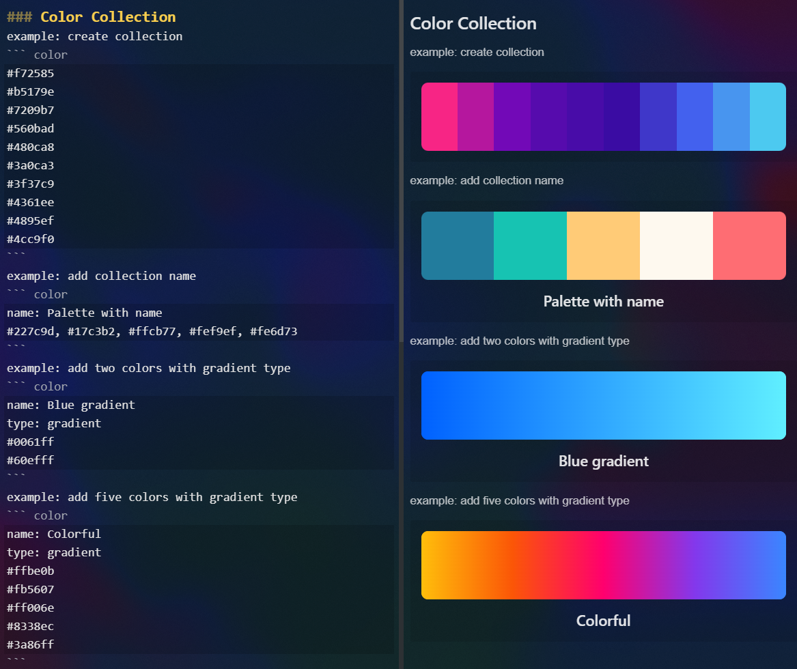

# Color Collection
a plugin for collecting and visualizing your colors in Inkdrop


# Installation
```
ipm install color-collection
```

# Usage
1. create code block with `color` type
2. put your colors in the block
3. *optional* add collection name by adding below:
   ```
   name: YOUR_COLLECTION_NAME
   ```
4. *optional* add gradient type by adding below:
   ```
   type: gradient
   ```


# Examples

# Changelog
## 0.1.0 - First Release
* color code block: solid color
* color code block: gradient color
